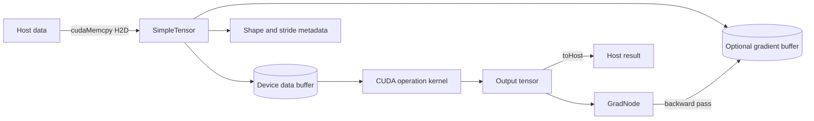
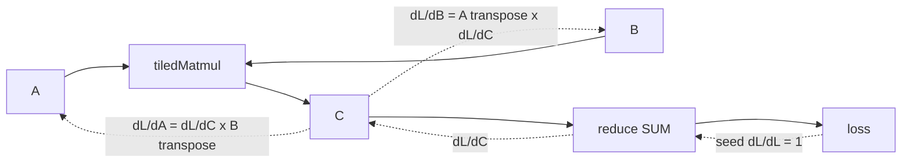
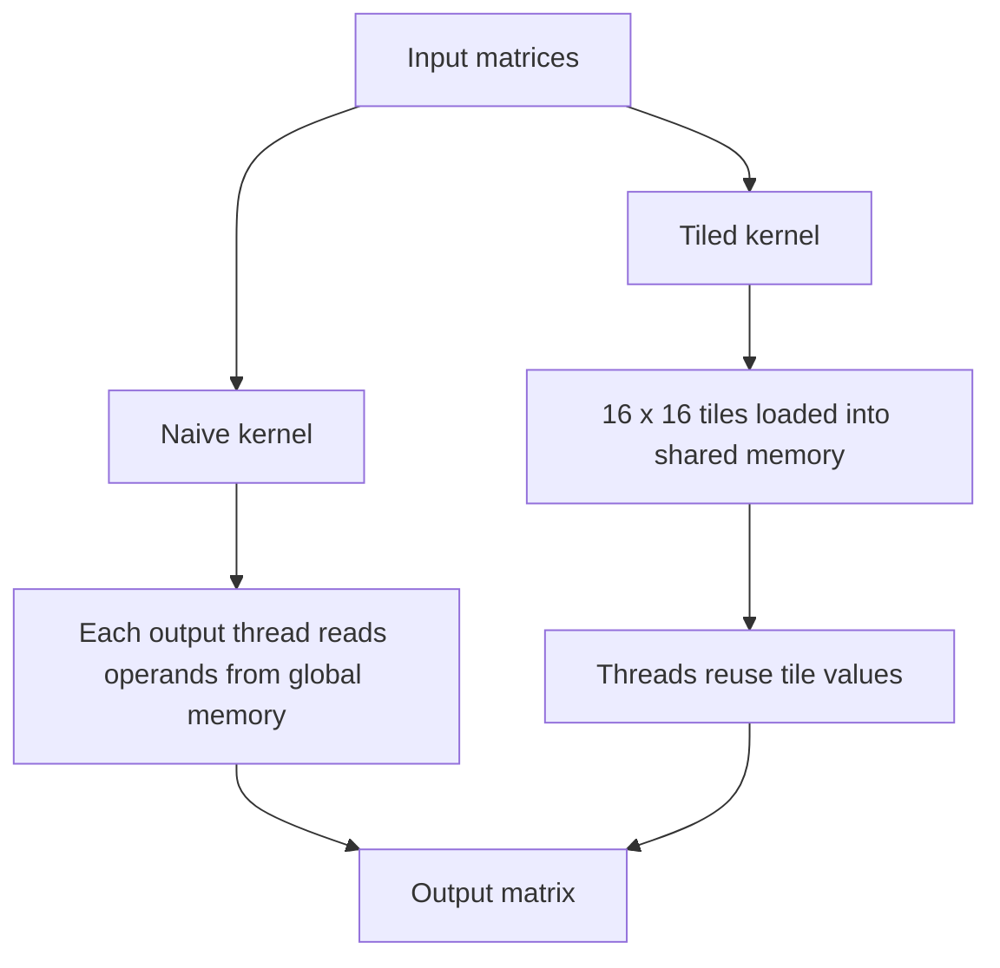

# SimpleTensor

SimpleTensor is a small tensor library written in CUDA C++. It keeps tensor data on the GPU, launches custom CUDA kernels for common operations, and records a lightweight computation graph for reverse-mode automatic differentiation.

The project is intentionally compact: the tensor implementation, CUDA kernels, and autograd machinery can all be read without working through a large framework first. It is best suited to learning, kernel experimentation, and benchmarking rather than production workloads.

## What is implemented

- GPU-backed, row-major tensor storage
- Construction from host data or zero-initialized device memory
- Shape and stride tracking with reshape support
- Element-wise arithmetic
- Scalar arithmetic
- Sum, mean, min, max, and product reductions
- Naive and 16 x 16 tiled matrix multiplication
- ReLU activation
- Reverse-mode autograd for selected operations
- Deep-copy and move semantics for device-backed tensors
- Host transfers for values and gradients

## Architecture



Tensor metadata remains on the CPU while values and gradients live in CUDA device memory. Operations allocate a new output tensor and launch a kernel against the input buffers. When an operation participates in autograd, its output also stores a `GradNode` containing the backward function and links to preceding nodes.

### Autograd example

For `loss = sum(A x B)`, the recorded graph and gradient flow are:



`backward()` topologically sorts this graph, then executes its nodes from the output back toward the leaves. Gradient kernels accumulate into each tensor's gradient buffer, allowing a tensor to contribute through more than one path.

## Requirements

- An NVIDIA GPU with CUDA support
- NVIDIA CUDA Toolkit, including `nvcc`
- A C++17-compatible host compiler
- GNU Make

The included Makefile invokes `nvcc` directly and has no third-party library dependencies.

## Build and run

Clone the repository, then build the example and benchmark program:

```bash
make
./main
```

Remove the compiled executable with:

```bash
make clean
```

The program in `tensor/main.cu` exercises tensor construction, reductions, matrix multiplication, and gradient propagation. It also runs three benchmarks:

1. Naive versus tiled 1024 x 1024 matrix multiplication
2. Forward and backward time for a 512 x 512 matrix multiplication
3. Single-threaded CPU versus tiled GPU matrix multiplication

Benchmark results depend on the GPU, CUDA version, host compiler, power state, and thermal conditions. The harness performs one GPU warm-up and reports average GPU time over ten runs for the matrix multiplication comparisons.

## Basic usage

```cpp
#include "tensor/tensor.h"
#include "tensor/ops.h"

#include <iostream>

int main() {
    float aData[] = {
        1.0f, 2.0f,
        3.0f, 4.0f
    };
    float bData[] = {
        5.0f, 6.0f,
        7.0f, 8.0f
    };

    SimpleTensor<float> a({2, 2}, 2, aData, true);
    SimpleTensor<float> b({2, 2}, 2, bData, true);

    auto product = tiledMatmul(a, b);
    auto loss = reduceOp(product, ReduceOp::SUM);
    loss.backward();

    for (float value : product.toHost()) {
        std::cout << value << ' ';
    }

    std::cout << '\n';

    for (float gradient : a.toHostGrad()) {
        std::cout << gradient << ' ';
    }
}
```

Compile a separate program against the implementation files with:

```bash
nvcc -std=c++17 -O2 example.cu tensor/tensor.cu tensor/ops.cu -o example
```

## API overview

### Tensor lifecycle and data access

| API | Description |
| --- | --- |
| `SimpleTensor(shape, dimensions, data, requiresGrad)` | Allocates device memory and copies a host buffer to it |
| `SimpleTensor(shape, dimensions, requiresGrad)` | Allocates a zero-initialized device buffer |
| `reshape(shape, dimensions)` | Changes metadata without moving data; element count must remain unchanged |
| `setBuffer(data, size)` | Replaces tensor values from a host buffer |
| `toHost()` | Copies tensor values into a host `std::vector` |
| `toHostGrad()` | Copies gradients into a host `std::vector` |
| `print()` | Prints tensor contents after copying them to the host |
| `getBuffer()` / `getGradBuffer()` | Returns the underlying device pointer |

Shapes use contiguous row-major strides. A tensor with shape `{2, 3, 4}` therefore has strides `{12, 4, 1}` and stores 24 elements.

### Operations

| Operation | Variants | Autograd support |
| --- | --- | --- |
| `elementOp` | add, subtract, multiply, divide | add and multiply |
| `scalarOp` | add, subtract, multiply, divide | no |
| `reduceOp` | sum, mean, max, min, product | sum |
| `naiveMatmul` | 2D matrix multiplication | no |
| `tiledMatmul` | 2D matrix multiplication | yes |
| `reluForward` | element-wise ReLU | yes |

Element-wise operations require identical input shapes. Matrix multiplication accepts two 2D tensors whose inner dimensions match. Broadcasting, batched matrix multiplication, and dimension-wise reductions are not currently implemented.

## Matrix multiplication kernels

SimpleTensor includes two implementations of the same 2D operation:



The naive kernel is a direct reference implementation: one thread computes one output element and reads its operands from global memory. The tiled kernel moves 16 x 16 blocks of both inputs into shared memory, synchronizes the block, and reuses those values while accumulating the result. Keeping both makes the cost of global-memory traffic visible in the included benchmark.

## Project layout

```text
.
|-- tensor/
|   |-- tensor.h      Tensor and autograd node declarations
|   |-- tensor.cu     Memory management, host transfers, and backward traversal
|   |-- ops.h         Operation and kernel declarations
|   |-- ops.cu        CUDA kernels, operation wrappers, and gradient rules
|   `-- main.cu       Examples, gradient checks, and benchmarks
|-- hello.cu          Standalone introductory CUDA kernel examples
|-- makefile          Build configuration
`-- README.md
```

## Current scope

SimpleTensor is an experimental implementation with a deliberately narrow API. It currently assumes contiguous storage, does not broadcast shapes, and does not provide a CPU fallback. Autograd covers the operations listed in the table above; using another operation in a differentiable chain will not propagate a mathematically complete gradient.

CUDA calls made during allocation and host transfers are checked immediately. Kernel launches are generally asynchronous, so call `cudaDeviceSynchronize()` when measuring execution time or when an immediate kernel error must be surfaced.

## Possible next steps

- Add automated correctness tests against CPU reference implementations
- Check kernel launch and synchronization errors consistently
- Add broadcasting and reductions along selected dimensions
- Extend gradient rules to scalar arithmetic and all element-wise operations
- Support batched matrix multiplication
- Add CUDA streams and a reusable device-memory allocator
- Benchmark against cuBLAS as an optimized reference
